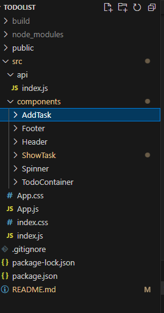

# Todolist using React app
A Todolist app where user can add and maintain todo item using react app.

## Features included
* #### Add Todo ####
  Add todo item to the todo list.

* #### Display Todos ####
  A list view to display all current todos.

* #### Update Todo ####
    Update the todo item entered

* #### Delete Todo ####
    Delete any todo from the list

* #### Check out Todo ####
    Strike out the todo that is completed

## Folder structure
    
  * src
    * api
      * index: component which contain extracting data from api and functions like add, delete and update on the data
    * components
      * AddTask : component which takes care of adding new task and editing existing task 
      * Header: component that displays header
      * ShowTask: component that displays the list of all todo items added by the user
      * TodoContainer: a container component in which other components are used
    * App: component which acts a container for all the other components
    * index: the entry point of the project

## Links
1. [Code link](https://github.com/Meghna24R/Todo-List-App)
2. [Hosted link](https://meghna24r.github.io/Todo-List-App/)